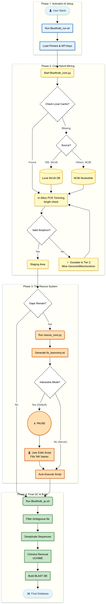

# 🐟 BlueFinDB v3.0: High-Confidence Reference Database Creator
1. BlueFinDB is an automated bioinformatics pipeline designed to construct taxonomically curated reference databases for environmental DNA (eDNA) metabarcoding. It accepts a target species list and generates a validated, local BLAST database for specific marker genes, including COI, 12S, 16S, and 18S.

2. The reproducibility of environmental DNA (eDNA) metabarcoding depends entirely on transparent and replicable workflows for creating complete, curated reference databases.Conventional curation tools (such as RESCRIPT, CRUX, and OBITools) often operate as rigid, non-flexible workflows. They frequently discard valid taxa due to minor primer mismatches or fail completely when specific marker sequences are absent in public repositories.

3. BlueFinDB addresses this gap with an open-source, multi-marker pipeline designed for flexibility and high recovery rates. It builds highly accurate, project-specific reference libraries for 12S, COI, 16S, and 18S markers. By utilizing standard primer sets (e.g., MiFish, Leray-XT, Vences V4, and Stoeck V9) according to researcher preference, it ensures that valid data is retained and curated rather than discarded.


<<<<<<< HEAD
## Key Features of BlueFinDB v3.0

### 1. Enterprise-Grade NCBI Retrieval Architecture 

    **Fault-tolerant querying:** Custom robust_esearch wrapper with exponential backoff that automatically detects and recovers from HTTP 500/502 and “Backend Failed” errors for stable high-throughput retrieval.

    **Smart rate limiting:** Integrates NCBI API key management to dynamically control request rates and prevent IP blocking.

 ### 2. Tier-2 Genomic Rescue & Mining System

    **Mitogenomic & WGS traversal:** Activates a Tier-2 protocol when standard marker sequences are missing, enabling mining of full mitochondrial genomes and Whole Genome Shotgun (WGS) projects.

    **Algorithmic extraction:** Applies precise coordinate mapping to locate and extract target amplicons from large-scale genomic records, recovering valid taxa that standard scrapers often miss.

 ### 3. Advanced In-Silico PCR Simulation

    **Heuristic primer sweeping:** Implements a "Dragnet" approach that iteratively tests broad primer suites (e.g., MiFish-U vs. MiFish-E, or specific 16S mammal/bacteria sets) rather than single pairs, maximizing taxonomic coverage.

    **Degeneracy & mismatch handling:** Integrates Cutadapt with logic to resolve IUPAC nucleotide ambiguity codes (e.g., W, Y, R) and reverse complements, simulating laboratory PCR thermodynamics to ensure biological accuracy.

 ### 4. Automated Curation & Quality Control Pipeline

    **Phylogenetic lineage checks:**  Cross-references each sequence with the NCBI Taxonomy database to ensure required ranks (Class, Order, Family) are present, removing incomplete or “orphan” entries.
    **VSEARCH-based QC:** Executes a rigorous QC workflow including global dereplication (100% identity clustering), strict ambiguous base filtering (--fastq_maxns 1), and de novo chimera detection (--uchime_denovo) to ensure a publication-ready reference library.

### 5. Self-Healing “Auto-Patch” Architecture
     **Automated remediation scripting:**  When gaps are detected, the pipeline doesn’t stop; it generates a custom Bash script (`fix_taxonomy.sh`) with precise instructions to inject missing sequences and patch metadata, allowing one-step database repair.

     **Taxonomic metadata injection:**  Automatically retrieves complete lineage strings (Class, Order, Family, etc.) and fills missing fields to restore database integrity.

### 6. Specialized Feature: 18S Hybrid-Retrieval Engine

    **Hierarchical Database Logic:** Uniquely implements a priority-based search algorithm for 18S rRNA. The system first queries high-quality, locally curated repositories (e.g., SILVA 138.1 SSURef NR99) to guarantee superior taxonomic resolution.

    **Latency & Load Optimization:** By resolving eukaryotic markers locally, the pipeline drastically reduces API latency and computational overhead, falling back to NCBI remote queries only when local curated matches are exhausted.

### 7. Real-Time Telemetry & Visual Analytics

    **Rich console interface:**  Provides a high-contrast, professional CLI (via the `rich` library) with real-time telemetry, status updates, color-coded indicators, and summary tables for easy monitoring of large-scale runs.
  
    **Smart resume capability:**  The core engine utilizes intelligent file checking to detect previously downloaded or trimmed files. If a job is interrupted, BlueFinDB resumes exactly where it left off without re-downloading gigabytes of data.


### 8. Strict Provenance & Reproducibility

    **Automated manifest logging:** Each run generates a `BlueFinDB_Manifest.txt` file capturing timestamps, software version, primer sets used, and all filter parameters—providing a complete audit trail suitable for publication-grade reproducibility.

  
## 🛠️ Dependencies 

### 1. Core Bioinformatics Tools
    
    **NCBI BLAST+ (`makeblastdb`):** Used to build the final local reference database.
    **VSEARCH (`vsearch`):** Performs chimera detection, dereplication, and strict quality filtering.
    **Cutadapt (`cutadapt`):** Executes precise in-silico primer trimming.
    **NCBI Entrez Utilities (`esearch`, `efetch`, etc.):** Powers high-throughput sequence retrieval and metadata access.

### 2. Python Libraries

     **Python 3.8+**  
     **biopython:** For handling FASTA I/O and Entrez API calls.
     **rich:** For the professional CLI dashboard and progress spinners.

### 3. System Utilities

    **wget:** Required to download the local SILVA database automatically.
    **awk, sed, grep, gunzip:** Used extensively for text stream processing.

---
=======
BlueFinDB integrates the best practices of complex pipelines (like in silico PCR and taxonomic API tracing) into a single, accessible Bash/Python workflow:
**100% Taxonomically Validated**: Automatically performs a 1:1 lookup against NCBI using the Accession ID to retrieve and integrate the official TaxID, Class, Order, and Family into the FASTA header, guaranteeing data traceability and credibility.

**Molecular Fidelity (Dual-Trimming)**: Employs mismatch-tolerant in silico PCR (cutadapt -e 0.20) with a competitive dual-trimming logic (MiFish-U and MiFish-E) to maximize the isolation of the optimal gene fragment for mixed fauna (Teleosts and Elasmobranchs).

**Targeted Curation**: Uses a sequence length filter (AND 100:1500[SLEN]) in the NCBI query to deliberately exclude massive mitochondrial genomes and prioritize trimmable 12S-specific gene fragments for reliable amplicon preparation.

**Zero-Step Deployment**: Automatically executes makeblastdb (Stage 6) after curation, providing a fully indexed, searchable database file that is immediately ready for blastn queries.

**Full Traceability**: Generates detailed audit logs (bluefindb_run.log and cutadapt_details.log) documenting every API call, trimming attempt, and final accession used for reproducible science.

## 📥 Requirements & Setup
OS: Linux, macOS, or WSL (Windows Subsystem for Linux).

Core Tools: python3 (with Biopython), NCBI EDirect (esearch, efetch), and BLAST+ (makeblastdb, blastn).

Trimming Tool: cutadapt (required if using the --mifish-preset or --trim-primers flags).
>>>>>>> 66bf02d623b85a9b3a53dc94fee3a7d2502edc23

## 📂 File Structure

The repository is organized into a modular architecture.

```text
BlueFinDB/
<<<<<<< HEAD
├── 📜 Bluefindb_run.sh          # 🚀 MASTER SCRIPT: Run this to start the pipeline
├── 📜 Bluefindb_qc.sh           # Standalone Quality Control (QC) module
├── 🧠 core/                     # Intelligence Engine
│   ├── Bluefindb_core.py        # Main hybrid-mining & retrieval logic
│   └── rescue_core.py           # Tier-2 Rescue & Auto-Patch generator
├── 📁 Data/                     # Input directory (Place your species lists here)
├── 📂 output/                   # Results directory (FASTA databases & logs)
├── 🧪 test/                     # Validation Sandbox
│   ├── 📜 Bluefindb_test_run.sh # Test pipeline launcher
│   ├── 📜 Bluefindb_qc.sh       # QC script for testing environment
│   ├── 📁 Data/                 # Sample datasets for verification
│   └── 📂 output/               # Test run results
├── ⚖️ LICENSE
└── 📖 Readme.md

---
## ⚙️ Script Architecture 
=======
├── run_bluefindb.sh          # The main launcher script (user interface)
├── bluefindb_core.py         # The Python engine (all logic and validation)
├── species_list.txt          # ⬅️ User Input File
├── fish_12s_raw/             # Downloaded raw sequences
├── fish_12s_filtered/        # Best sequence per species (pre-merge)
├── BlueFinDB_12S_Fish.n* # Final BLAST index files
├── bluefindb_run.log         # Complete execution history and API calls
└── cutadapt_details.log      # Molecular audit log for trimming alignment

>>>>>>> 66bf02d623b85a9b3a53dc94fee3a7d2502edc23

### 1. Bluefindb_run.sh (The Orchestrator)

  **Function:** Mission Control & Pipeline Management This is the master entry point. It does not perform bioinformatic analysis itself; instead, it manages the workflow logic:

    **Environment Validation:** Checks for all dependencies (cutadapt, vsearch, makeblastdb) and API keys before starting.

    **Dynamic Configuration:** Sets active primer sequences based on user flags (e.g., loading MiFish primers for --12S vs. Leray-XT for --COI).

    **Flow Control:** Executes the Core Engine, monitors exit codes, triggers the Rescue System if gaps are detected, and finally launches the QC module.

<<<<<<< HEAD
### 2. Bluefindb_core.py (The Mining Engine)
=======
Gadus morhua|Gadidae|Atlantic_cod
Scophthalmus maximus|Scophthalmidae|Turbot
Sardina pilchardus|Clupeidae|European_sardine
>>>>>>> 66bf02d623b85a9b3a53dc94fee3a7d2502edc23

  **Function:** Retrieval, In-Silico PCR, & Hybrid Mining The computational heart of the tool. It performs the heavy lifting:

    **Hybrid Retrieval:** Executes the logic to check local databases (SILVA) first, then caches results, and finally queries NCBI.

    **Smart Trimming:** Runs cutadapt to simulate PCR, trimming sequences to the exact amplicon region while handling reverse complements.

    **Primer Dragnets:** For 16S/18S, it loops through "suites" of multiple primer sets (e.g., searching for both Mammal and Bacteria targets) to maximize recovery.

    **Genome Mining:** If a marker is missing, it downloads full genomes/mitochondria and slices out the target region.

### 3. rescue_core.py (The Self-Healing System)
 
  **Function:** Gap Analysis & Patch Generation This script runs after the core mining to fix failures. It does not just report errors; it programs a solution:

    **Failure Forensics:** Scans the accessions.tsv output to identify specific failure modes (Missing Sequence vs. Missing Taxonomy).

    **Auto-Patching:** Dynamically generates a custom Bash script (fix_taxonomy.sh) containing precise instructions to download missing accessions or inject missing lineage metadata.

    **Taxonomy Injection:** Retrieves full lineage strings (Class/Order/Family) for "orphan" sequences to ensure the final database is taxonomically complete.

### 4. Bluefindb_qc.sh (The Quality Assurance Module)

  **Function:** Filtering, Dereplication, & Database Building A standalone module that ensures the final output is publication-ready. It uses VSEARCH for strict quality control:

    **Ambiguity Filtering:** Removes sequences containing >1 ambiguous base (N).

    **Dereplication:** Identifies and merges 100% identical sequences to reduce database redundancy.

    **Chimera Detection:** Scans for and removes chimeric artifacts using uchime_denovo.

    **Final Build:** Compiles the clean FASTA into a local BLAST database (makeblastdb) and generates the reproducibility manifest.

## 💻 Usage & Execution

### **Step 1:** Populate Your Species List

  Navigate to the Data/ folder. You will find four ready-made text files:

    species_list_12s.txt

    species_list_16S.txt

    species_list_18S.txt

    species_list_COI.txt

  Open the file corresponding to your target marker and add your species using the pipe-delimited format: 
  Scientific Name|Family|Common_Name

  Example: 
           Merluccius merluccius|Merlucciidae|European_hake
           Gadus morhua|Gadidae|Atlantic_Cod

### **Step 2:** Configure the Master Script

  Tell BlueFinDB which file to use by editing the default configuration.

    - Open Bluefindb_run.sh in any text editor.

    - Locate the section # --- CONFIGURATION DEFAULTS --- (lines 20-25).

    - Change the DEFAULT_INPUT_FILE variable to match the text file you just edited.

   Example : 
          # --- CONFIGURATION DEFAULTS ---
          VERSION="v3.0"
          DEFAULT_SLEEP=1 
          DB_NAME_BASE="BlueFinDB"

          # CHANGE THIS LINE to your specific file (e.g., 16S, 18S, etc.)
            DEFAULT_INPUT_FILE="Data/species_list_16S.txt"

### Step 3: Run the Pipeline 

   **🐟 For 12S (Fish):**Targets mitochondrial 12S rRNA (MiFish-U/E).

                       bash Bluefindb_run.sh --12S

  **🦀 For COI (Invertebrates):** Targets mitochondrial COI (Leray-XT).
                       bash Bluefindb_run.sh --COI

  **🐋 For 16S (Vertebrates/Mammals):** Activates the Universal 16S Suite (Mammals + Bacteria).
  
                       bash Bluefindb_run.sh --16S

 **🍄 For 18S (Eukaryotes/Fungi):** Activates the Hybrid Mining Engine (Local SILVA + NCBI).
                      
                       bash Bluefindb_run.sh --18S

## ⚙️ Workflow Mechanics: Under the Hood
  
  BlueFinDB executes a linear, state-aware pipeline.It transitions automatically between scripts, passing data from the Mining Phase (Tier 1) to the Rescue Phase (Tier 2) and finally to the Build Phase.

### 1.SHow to Configure

  - Run these commands in your terminal before starting the pipeline.

    export BFD_EMAIL="your.email@university.edu" ([REQUIRED] Your email address for NCBI audit trails)

    export NCBI_API_KEY="abcdef1234567890"([RECOMMENDED] Your NCBI API Key for faster mining)

### 2. Verification System (--check-status)

  - BlueFinDB has a built-in diagnostic tool that autmatically validates your connection and credentials before the start of the pipeline, But if you wish to check it before starting teh pipeine you can run it using this command 

    bash Bluefindb_run.sh --check-status

### 3. Activation & Configuration (Bluefindb_run.sh)

 - This shell script acts as the pipeline's "Switchboard," handling environment setup before any bioinformatics processing begins.

   **General Syntax**
   bash Bluefindb_run.sh [MARKER_FLAG]

   **Example: Run 12S pipeline**
   bash Bluefindb_run.sh --12S


### 4. Targeted Primer Sets

  - BlueFinDB does not rely on generic searching. It utilizes specific, publication-validated primer sets to perform precise in-silico PCR. The system distinguishes between Static Markers (12S/COI) which use fixed pairs, and Dynamic Markers (16S/18S) which use sweeping "Suites."

   **🐟 1. 12S rRNA (Fish):**

   The pipeline deploys the industry-standard MiFish primers.

| Name | Direction | Sequence (5' -> 3') | Target |
| :--- | :--- | :--- | :--- |
| **MiFish-U** | Forward | `GTCGGTAAAACTCGTGCCAGC` | Bony Fish (Teleosts) |
| **MiFish-U** | Reverse | `CATAGTGGGGTATCTAATCCCAGTTTG` | Bony Fish (Teleosts) |
| **MiFish-E** | Forward | `GTCGGTAAAACTCGTGCCAGC` | Sharks & Rays (Elasmobranchs) |
| **MiFish-E** | Reverse | `CATAGTGGGGTATCTAATCCTAGTTTG` | Sharks & Rays (Elasmobranchs) |


 **🦀 2. COI (Invertebrates):**

  The pipeline uses the highly degenerate Leray-XT primers. These sequences contain "Wobble Bases" (e.g., W,Y,R,I) to account for the high genetic variability found in marine invertebrates.

| Name | Direction | Sequence (5' -> 3') | Target |
| :--- | :--- | :--- | :--- |
| **Leray-XT** | Forward | `GGWACWGGWTGAACWGTWTAYCCYCC` | Metazoan Invertebrates |
| **Leray-XT** | Reverse | `TAIACYTCIGGRTGICCRAARAAYCA` | Metazoan Invertebrates |

 **🐋 3. 16S rRNA (Vertebrates & Bacteria):**

  The pipline activates a Universal Suite that iteratively tests 6 different primer pairs against every downloaded sequence to maximize recovery.
 
| Suite Name | Forward Primer (5' -> 3') | Reverse Primer (5' -> 3') | Specific Target |
| :--- | :--- | :--- | :--- |
| **16S_Vert_Std** | `CGCCTGTTTATCAAAAACAT` | `CCGGTCTGAACTCAGATCACGT` | Standard Vertebrates (Frogs/Reptiles) |
| **16S_Mammal_Mod** | `CGCCTGTTTACCAAAAACAT` | `CCGGTCTGAACTCAGATCACGT` | Mammals & Whales |
| **16S_Mammal_Short** | `CGGTTGGGGTGACCTCGGA` | `GCTGTTATCCCTAGGGTAACT` | Degraded DNA (Short fragments) |
| **16S_Cetacean** | `CGTTTTTTGGTCGACAGCC` | `CCGGTCTGAACTCAGATCACGT` | Cetaceans (MarVer3) |
| **16S_Bacteria** | `CCTACGGGNGGCWGCAG` | `GACTACHVGGGTATCTAATCC` | General Bacteria (V3-V4 Region) |
| **16S_NoChloro** | `AACMGGATTAGATACCCKG` | `ACGTCATCCCCACCTTCC` | Bacteria (Excludes Chloroplasts) |

**🍄 4. 18S rRNA (Eukaryotes):**

  The 18S module sweeps through a specialized suite designed to capture distinct eukaryotic groups, ensuring that elusive taxa like Fungi and Nematodes are not missed during the in-silico PCR step.

| Suite Name | Forward Primer (5' -> 3') | Reverse Primer (5' -> 3') | Specific Target |
| :--- | :--- | :--- | :--- |
| **18S_Euk_General** | `GTACACACCGCCCGTC` | `TGATCCTTCTGCAGGTTCACCTAC` | Plankton / General Eukaryotes |
| **18S_Fungi_Best** | `CGATAACGAACGAGACCT` | `ANCCATTCAATCGGTANT` | Fungi Kingdom |
| **18S_Nema_Cov** | `GGCAAGTCTGGTGCCAG` | `TCCGTCAATTYCTTTAAGT` | Nematodes (Worms) - Coverage |
| **18S_Nema_Eco** | `GGTTAAAAMGYTCGTAGTTG` | `TGGTGGTGCCCTTCCGTCA` | Nematodes - Ecological |
| **18S_Ciliate** | `GGGRAACTTACCAGGTCC` | `GTGATRWGRTTTACTTRT` | Protozoa (Rumen Ciliates) |

### 5. Tier 1: Hybrid Mining & In-Silico PCR (Bluefindb_core.py)

  Control is passed to the Python Core. It executes the Tier-1 Retrieval Protocol.

    -**Step A: Smart Caching:** It checks the `output/raw_[MARKER]` directory. If a sequence was downloaded in a previous run, it loads the local copy instantly, skipping the network call. If not it downloads avalilaible user defined species specific marker sequnces from NCBI.

   -**Step B: In-Silico PCR (Trimming):** The core engine simulates a laboratory PCR reaction using Cutadapt.
    
   -e 0.20: Allows a 20% error rate (mismatches) to account for biological variation.

   --discard-untrimmed: Strictly removes sequences where primers do not bind.

  **⛔ Critical Step:** Length Validation After trimming, the engine measures the amplicon. It must fall within the strict biological ranges defined below. If a sequence is too short (noise) or too long (read-through errors), it is discarded immediately.

| Marker | Allowed Range | Why? |
| :--- | :--- | :--- |
| **12S** | 150 - 550 bp | Excludes short fragments; fits standard MiFish amplicons. |
| **COI** | 100 - 800 bp | Wide range to accommodate variable invertebrate barcodes. |
| **16S** | 100 - 600 bp | Captures both short mammal (140bp) and long vertebrate fragments. |
| **18S** | 100 - 1000 bp | Allows for variable regions in diverse eukaryotes/fungi. |

 **Logic:** The engine loops through all available sequences. It discards invalid ones until a suitable amplicon is found. If NO sequence passes this filter, the species is flagged as "Missing," and the system automatically escalates to Tier 2.

### 6. Tier 2: Deep Genomic Mining (The Fallback)

  **Trigger:** Activated immediately if Tier 1 fails to retrieve a valid, trimmable sequence. 
  **Strategy:**The engine shifts strategy to download the organism's larger genetic assemblies:
  
    - For 12S/16S/COI: It downloads the Complete Mitochondrion.

    - For 18S: It searches for Whole Genome Sequences (WGS). 
    
    Action: It performs in-silico PCR on these large assemblies to mathematically "slice out" the target amplicon. This allows BlueFinDB to recover data even when the specific marker gene was never uploaded to NCBI as a standalone entry.

### 7. The Rescue System (`rescue_core.py`)

  **Trigger:**
  This phase begins **after** the Core Engine (Tier 1 & 2) has finished processing the entire species list. If gaps still remain (i.e., both Tier 1 and Tier 2 failed), the pipeline automatically launches the Rescue Script.

    #### The Critical Decision: Interactive vs. Non-Interactive
    Once rescue targets are identified (or if manual intervention is needed for missing accessions), the pipeline behavior depends entirely on your execution flag:

     **A. Interactive Mode (Default & Recommended)**
     The pipeline **PAUSES** and alerts you:
     > `⚠️ Action Required: Please open fix_taxonomy.sh`

  You can open the generated script, manually paste a specific Genome/Mitochondrion Accession ID to "help" the rescue engine, and press **[Enter]** to resume.

    ```bash
    bash Bluefindb_run.sh --12S

    **B. Non-Interactive Mode (--non-interactive):** The pipeline NEVER STOPS. It immediately executes the rescue script to attempt the automated genomic mining. Use this only for high-throughput server jobs.

      bash Bluefindb_run.sh --12S --non-interactive

### 8. How to Edit the Rescue Script (fix_taxonomy.sh)

   This script is the final safety net of the BlueFinDB pipeline. It is generated automatically by rescue_core.py only when specific species have failed both Tier 1 (Direct Mining) and Tier 2 (Genome Rescue).
    
    A. **Why am I seeing this? (The "Last Resort" Principle)**

    - If a species appears in this script, it means BlueFinDB has already scoured NCBI for direct marker entries, complete mitochondria, and whole genomes, but found nothing that matches your quality criteria.

    - You are now manually intervening to point the tool toward a sequence it might have missed (e.g., a new submission, a synonym, or a raw unannotated file).

     B. **How to Edit the File**

     The script is custom-built based on the specific failures of your current run. You simply need to "fill in the blanks" for the variables marked NA_FILL_ME.

     Step A: Open the File When the pipeline pauses in Interactive Mode, open fix_taxonomy.sh in any text editor.

     Step B: Find a Valid Accession Search NCBI Nucleotide for your species. Find a valid Accession ID (e.g., AF518210 or NC_001234) that contains the target gene.

     Step C: Fill in the Blank Paste the ID into the variable.

     # --- BEFORE EDITING (What the script generates) ---
     # 🐟 FIX REQUIRED: Sebastes_marinus (Reason: FAILED_ALL_PRIMERS)
     CORRECT_ACCESSION_SEBASTES_MARINUS="NA_FILL_ME__SEBASTES_MARINUS_ACC"

     # --- AFTER EDITING (What you save) ---
     # 🐟 FIX REQUIRED: Sebastes_marinus
      CORRECT_ACCESSION_SEBASTES_MARINUS="AF518210"

    C. **Strategic Warning: "Amplicons > Genomes"**
       
       Do not simply provide another Whole Genome or Complete Mitochondrion accession.

       - Why? The automated Tier-2 system has likely already attempted to mine these assemblies and failed due to assembly gaps or primer mismatches in that specific region.

       - The Winning Strategy: To guarantee a successful rescue, search NCBI for a specific, high-quality amplicon (e.g., a direct PCR submission or partial CDS) that   strictly adheres to the Marker-Specific Target Range defined in the table above (e.g., 150-550bp for 12S). This removes alignment ambiguity and maximizes the success rate of the in-silico trimming.

    D. **Patching Missing Taxonomy**
       
       Sometimes a sequence is valid, but NCBI returns incomplete lineage (e.g., missing Class or Order).

       Your Task: Locate the specific rank marked NA_FILL_ME and type the correct scientific name.

       📝 Code Block: Taxonomy Patching

        # --- BEFORE EDITING ---
        # Taxonomy for: Dicentrarchus_labrax
        CORRECT_TAXID_DICENTRARCHUS_LABRAX="13489"
        CORRECT_ORDER_DICENTRARCHUS_LABRAX="NA_FILL_ME__Dicentrarchus_labrax_ORDER" 

        # --- AFTER EDITING ---
        # Taxonomy for: Dicentrarchus_labrax
        CORRECT_TAXID_DICENTRARCHUS_LABRAX="13489"
        CORRECT_ORDER_DICENTRARCHUS_LABRAX="Moroniformes"

    E. **Execution**
        
        Once you have saved your changes:

        - Close the text editor.

        - Return to your terminal.

        - Press [Enter].

        - BlueFinDB will execute your patched script, download the specific accessions, trim them, and inject them into the final database.

### 9. 🍄 Special Feature: The 18S Hybrid Engine

    When running with the --18S flag, BlueFinDB activates a specialized Dual-Source Architecture designed specifically for the complexities of eukaryotic taxonomy. Unlike the other markers (which rely primarily on NCBI), the 18S module implements a strict priority system to ensure speed and taxonomic fidelity.

         A. How It Works: The Hybrid Protocol
        
         The pipeline executes a "Local-First" search strategy for every species in your list.

         **Step 1: Database Validation**

         - Logic: Before processing, the script checks for the local presence of the SILVA 138.1 SSURef NR99 database in Data/databases/.

         - Auto-Install: If the database is missing, BlueFinDB automatically downloads (wget) and decompresses (gunzip) the file.

         B. Step 2: Priority 1 - Local SILVA Mining

         - Command: awk (Fast Grep) Logic: The engine first searches the local SILVA database.

         - It uses optimized awk commands to scan headers for your species name without loading the massive 2GB+ file into RAM.

         - Data Cleaning: If a match is found, the script automatically sanitizes the sequence:

         - Gap Removal: Removes alignment gaps (. or -).

         - DNA Conversion: Converts RNA bases (U) to DNA bases (T) so primers can bind.

         C. Step 3: Priority 2 - NCBI Fallback

         - Logic: If—and only if—the species is not found in SILVA, the engine "fails over" to the NCBI Nucleotide database.

         D. Step 4: "Dragnet" Primer Sweeping

         - Logic: Once a raw sequence is retrieved (from either SILVA or NCBI), the engine runs In-Silico PCR. Because eukaryotes are highly diverse, a single primer pair is insufficient. BlueFinDB sweeps through the 18S Primer Suite:

         - Selection Algorithm: The engine tests all primers against the sequence. It selects the result that yields the longest valid amplicon within the target range (100 - 1000 bp).

         E. Why This Matters?

         - Speed: Resolving species locally via SILVA is ~50x faster than querying the NCBI API.

         - Accuracy: SILVA is professionally curated. Prioritizing it ensures your database uses high-quality reference taxonomy before falling back to the "noisy" public data of NCBI.   

### 10. QC & Final Build (Bluefindb_qc.sh)
     
     The final stage aggregates all successful sequences from Tier 1, Tier 2, and the Rescue Phase.

         - Filter: Removes sequences with >1 'N' (vsearch --fastx_filter).

         - Dereplicate: Merges 100% identical duplicates (vsearch --derep_fulllength).

         - Chimera Check: Removes PCR artifacts (vsearch --uchime_denovo).

         - Build: Creates the final local BLAST database.

## Validation & Testing (Sandbox)
  
    BlueFinDB includes a self-contained sandbox in the test/ directory to verify your installation before running real jobs.
        
        A. **Prerequisites**

        Ensure your email and API key are set in your terminal, otherwise the test will fail.
          
          export BFD_EMAIL="your.email@university.edu"
          export NCBI_API_KEY="your_api_key_here" 

        B. **Verify Test Data**

        The test/Data/ folder is already populated with sample species lists for verification:

          - species_list_12s.txt

          - species_list_16S.txt

          - species_list_18S.txt

          - species_list_COI.txt

        C. **Configure the Test Runner**

        Just like the main pipeline, you must tell the script which file to process.

          - Open test/Bluefindb_test_run.sh in a text editor.

          - Locate the DEFAULT_INPUT_FILE variable.

          - Update it to match the marker you want to test.

          # Inside Bluefindb_test_run.sh
            DEFAULT_INPUT_FILE="Data/species_list_12s.txt"

        D. **Run the Test**

        Navigate to the test folder and execute the script using the corresponding marker flag.

          cd test
          # Example: If you configured the file for 12S
          bash Bluefindb_test_run.sh --12S


## 📦 BlueFinDB Output File Reference

| File Name | Format / Type | Information Provided |
| :--- | :--- | :--- |
| `BlueFinDB_[MARKER].fasta` | FASTA | `output/` | The **final curated database file**. Contains optimized gene fragments (e.g., 12S, COI) with fully enriched, validated taxonomic headers (TaxID, Class, Order, Family, etc.). |
| `BlueFinDB_[MARKER].n*` | BLAST Index Files | `output/` | The BLAST binary index set (including `.nhr`, `.nin`, `.nsq`). These files are generated by `makeblastdb` and make your FASTA file instantly searchable for local BLAST alignment. |
| `BlueFinDB_Manifest.txt` | Text File | `output/` | Audit trail including run date, BlueFinDB version, active primer sequences, total sequence counts, and processing metadata. |
| `[MARKER]_accessions.tsv` | TSV | `output/` | Status report listing each target species, retrieved Accession ID, NCBI TaxID, and the final Pass/Fail retrieval status. |
| `fix_taxonomy.sh` | Shell Script | Auto-generated rescue module created only if missing taxonomy or failed species are detected. Contains logic to mine genomes or inject missing metadata. |
| `output/raw_[MARKER]/` | Directory | `output/` | Cache storage containing raw, untrimmed sequence downloads (NCBI or SILVA). Enables fast re-runs without redownloading. |
| `output/curated_[MARKER]/` | Directory | `output/` | Trimmed amplicons. Holds individual FASTA files for each species, cut precisely to the target marker length. |
| `output/logs/` | Directory | `output/` | Detailed execution logs, including `bluefindb_run.log` (master log), `cutadapt_details.log` (trimming stats), and `final_qc_and_build.log` (VSEARCH summary). |

## 🖼️ Workflow Diagram



##📜 Citation

 If you use BlueFinDB in your research, please cite the following:

    Vijayakumar, S. (2025). BlueFinDB: A Universal, Hybrid-Mining Reference Database Builder for eDNA Metabarcoding (Version 3.0) [Computer software]. GitHub. https://github.com/SUBRAMANIAM96/BlueFinDB         


##📄 License

 This project is open-source and available under the MIT License. You are free to copy, modify, and distribute this software, provided the original author is credited. See the LICENSE file for details.

##👨‍💻 Author & Contact

    **Subramaniam Vijayakumar**
    Role: Lead Developer & Bioinformatics Architect
    Tool Version: v3.0
    Contact: (vijayakumar.subraman@mail.ucv.es)

  